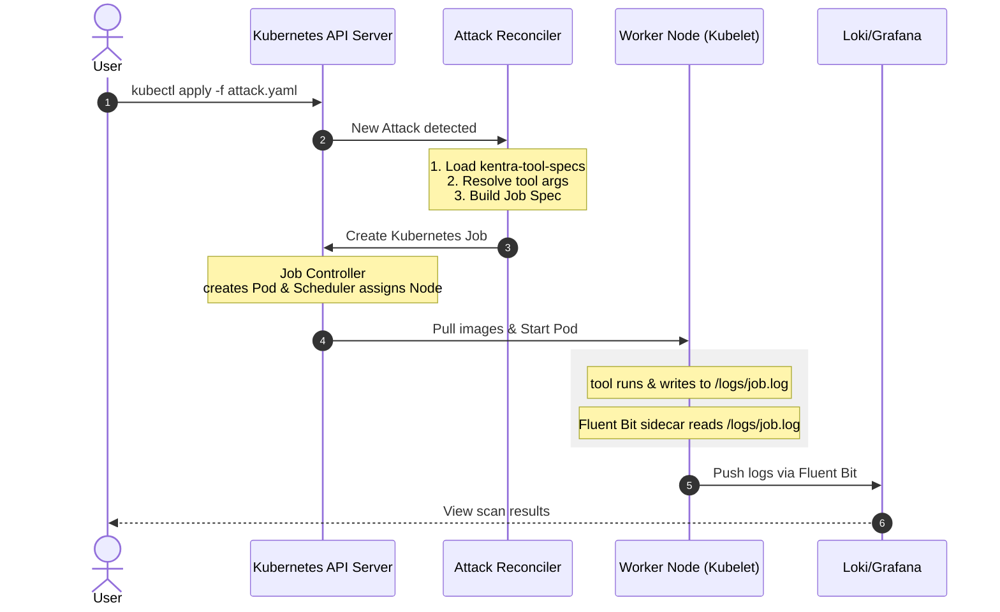

# Kentra Architecture

This document provides a comprehensive overview of the Kentra Kubernetes Operator architecture, including its components, design patterns, and interactions.

## Table of Contents

- [Kentra Architecture](#kentra-architecture)
  - [Table of Contents](#table-of-contents)
  - [High-Level Architecture](#high-level-architecture)
  - [List of CRDs](#list-of-crds)
    - [Attacks](#attacks)
    - [Pools](#pools)
  - [Flow Example with nmap scan](#flow-example-with-nmap-scan)

## High-Level Architecture

The workflow begins when an attack is defined in a YAML file and applied to the cluster, either manually or via a git push. This action creates a Custom Resource (CR) which the Kentra Controller monitors.

The entrypoint in `cmd/main.go` initializes the controller manager, registers specific controllers for each Custom Resource Definition (CRD), and sets up essential health checks. Supporting this, `cmd/manager.go` bootstraps the controller-runtime, configures RBAC for secure access, and manages the metrics and webhook servers.

Once a CR is detected, the reconciler translates the high-level specification into a standard Kubernetes Job. This Job launches a Pod containing two specific components: a main container that executes the security tool's CLI command and an optional Fluent Bit sidecar. If Loki is configured, the sidecar captures the tool's output and forwards it to Loki, allowing users to monitor live attack progress and results through Grafana. If not, the logs are shown in the pod logs.

## List of CRDs

### Attacks 
  | CRD | Description |
 | :--- | :--- |
| Liveness | Availability and health verification. |
 | Exploit | Active vulnerability testing. |
 | Osint | Reconnaissance and data gathering. |

### Pools
 | CRD | Description |
 | :--- | :--- |
 | Storage | Persistent data and artifact repositories. |
 | Asset | Grouped entities for miscellaneous purpose. |
 | Target | Grouped objects for scanning. |

## Flow Example with nmap scan

