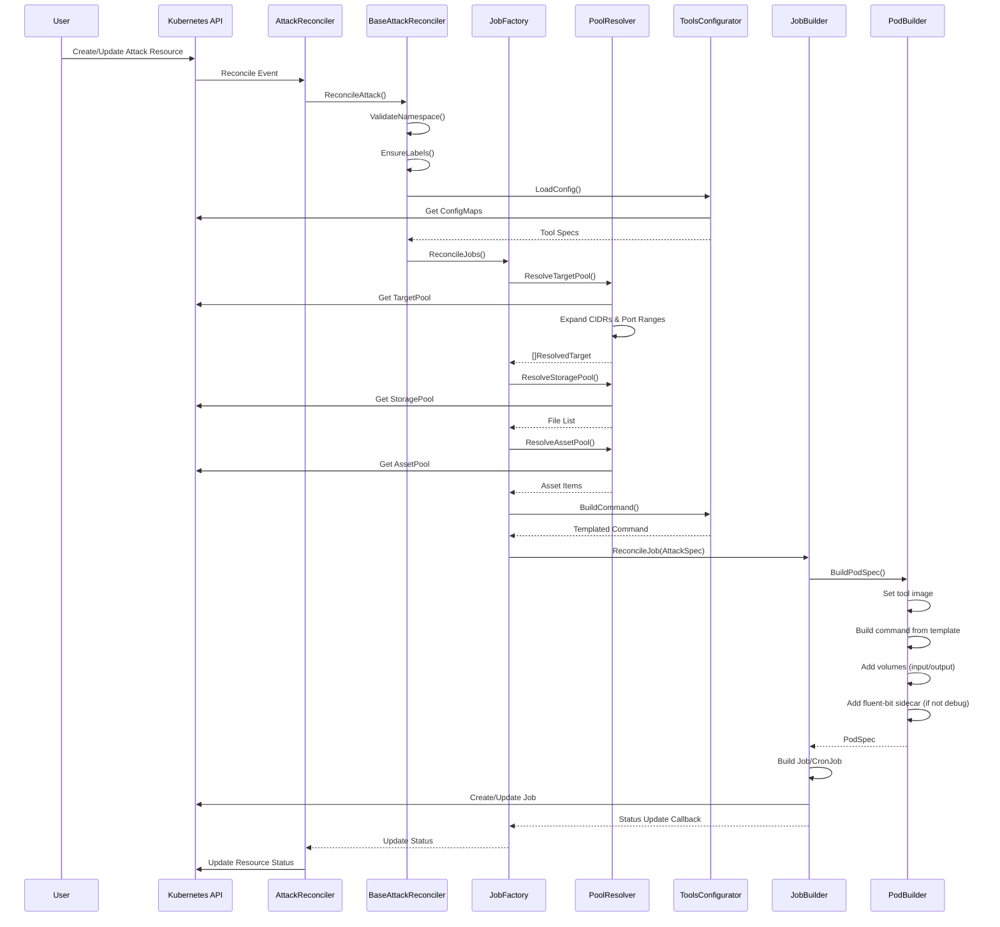
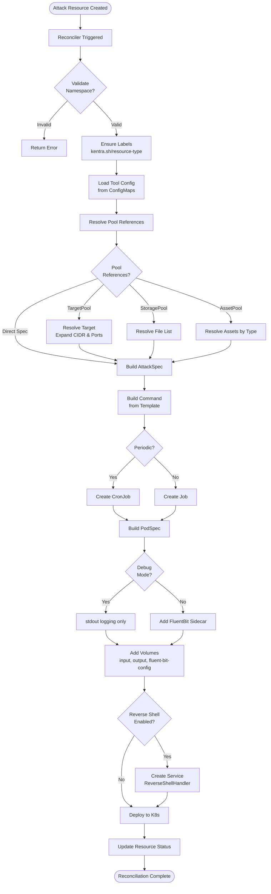
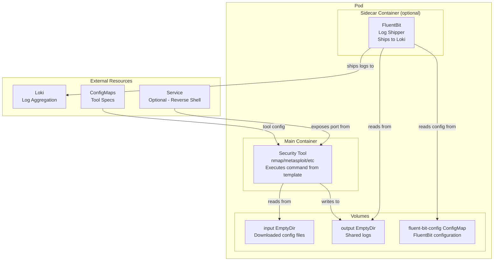
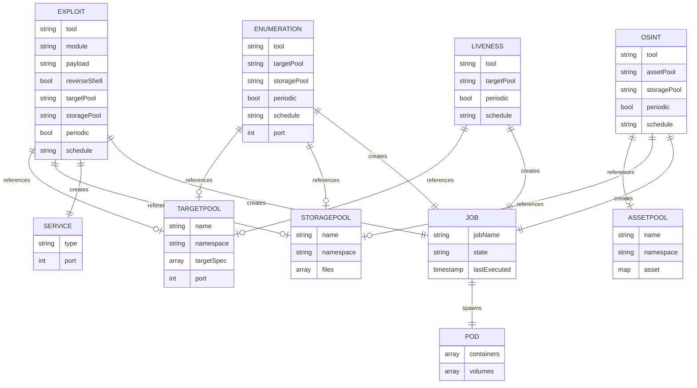
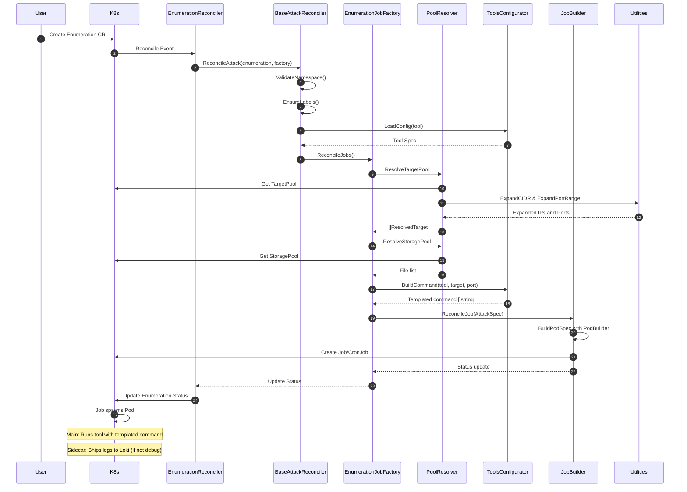
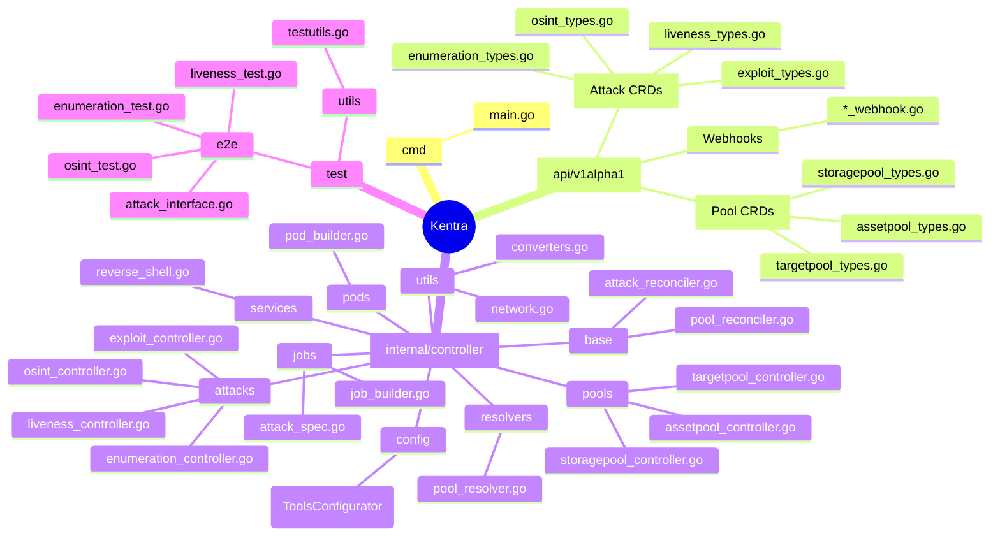
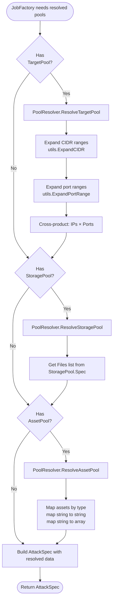

# Kentra Architecture - Mermaid Diagram

## High-Level System Architecture

```mermaid
graph TB
    subgraph "Entry Point - cmd/"
        MAIN[main.go<br/>Entry Point]
        CONFIG[CLI flags & config parsing]
    end

    subgraph "API Layer - api/v1alpha1"
        subgraph "Attack CRDs"
            EXPLOIT[Exploit<br/>Exploitation Tools]
            ENUM[Enumeration<br/>Network Scanning]
            OSINT[Osint<br/>Intelligence Gathering]
            LIVENESS[Liveness<br/>Connectivity Checks]
        end

        subgraph "Pool CRDs"
            TARGETPOOL[TargetPool<br/>Centralized Targets]
            STORAGEPOOL[StoragePool<br/>S3 File References]
            ASSETPOOL[AssetPool<br/>Asset Groupings]
        end
    end

    subgraph "Controller Layer - internal/controller"
        subgraph "Attack Controllers"
            EXPLOIT_CTRL[ExploitReconciler]
            ENUM_CTRL[EnumerationReconciler]
            OSINT_CTRL[OsintReconciler]
            LIVENESS_CTRL[LivenessReconciler]
        end

        subgraph "Pool Controllers"
            TARGET_CTRL[TargetPoolReconciler]
            STORAGE_CTRL[StoragePoolReconciler]
            ASSET_CTRL[AssetPoolReconciler]
        end

        subgraph "Base Logic"
            BASE_ATTACK[BaseAttackReconciler<br/>internal/controller/base]
            BASE_POOL[BasePoolReconciler<br/>internal/controller/base]
        end
    end

    subgraph "Internal Modules - internal/controller"
        subgraph "Job Management"
            JOB_BUILDER[JobBuilder<br/>internal/controller/jobs]
            JOB_FACTORY[JobFactory Interface<br/>EnumerationJobFactory, etc.]
        end

        subgraph "Pod Construction"
            POD_BUILDER[PodBuilder<br/>internal/controller/pods]
        end

        subgraph "Configuration"
            TOOLS_CONFIG[ToolsConfigurator<br/>internal/controller/config]
            CONFIGMAP[ConfigMap Loader<br/>label: kentra.sh/resource-type]
        end

        subgraph "Resolvers"
            POOL_RESOLVER[PoolResolver<br/>internal/controller/resolvers]
        end

        subgraph "Services"
            SERVICES_PKG[ReverseShellHandler<br/>internal/controller/services]
        end

        subgraph "Utilities"
            UTILS[Utilities<br/>internal/controller/utils]
        end
    end

    subgraph "Kubernetes Resources"
        JOBS[Jobs/CronJobs]
        PODS[Pods]
        SVCS[Services]
        CONFIGMAPS[ConfigMaps]
    end

    MAIN --> CONFIG
    MAIN --> EXPLOIT_CTRL
    MAIN --> ENUM_CTRL
    MAIN --> OSINT_CTRL
    MAIN --> LIVENESS_CTRL
    MAIN --> TARGET_CTRL
    MAIN --> STORAGE_CTRL
    MAIN --> ASSET_CTRL

    EXPLOIT --> EXPLOIT_CTRL
    ENUM --> ENUM_CTRL
    OSINT --> OSINT_CTRL
    LIVENESS --> LIVENESS_CTRL

    TARGETPOOL --> TARGET_CTRL
    STORAGEPOOL --> STORAGE_CTRL
    ASSETPOOL --> ASSET_CTRL

    EXPLOIT_CTRL --> BASE_ATTACK
    ENUM_CTRL --> BASE_ATTACK
    OSINT_CTRL --> BASE_ATTACK
    LIVENESS_CTRL --> BASE_ATTACK

    TARGET_CTRL --> BASE_POOL
    STORAGE_CTRL --> BASE_POOL
    ASSET_CTRL --> BASE_POOL

    BASE_ATTACK --> JOB_FACTORY
    BASE_ATTACK --> TOOLS_CONFIG

    JOB_FACTORY --> JOB_BUILDER
    JOB_FACTORY --> POOL_RESOLVER

    JOB_BUILDER --> POD_BUILDER

    TOOLS_CONFIG --> CONFIGMAP
    CONFIGMAPS --> CONFIGMAP

    POOL_RESOLVER --> TARGETPOOL
    POOL_RESOLVER --> STORAGEPOOL
    POOL_RESOLVER --> ASSETPOOL

    EXPLOIT_CTRL --> SERVICES_PKG
    SERVICES_PKG --> SVCS

    JOB_BUILDER --> JOBS
    JOBS --> PODS

    POOL_RESOLVER --> UTILS
    JOB_BUILDER --> UTILS
```



## Detailed Reconciliation Flow



## Attack Execution Flow



## Pod Architecture



## CRD Relationships



## Configuration & Template System

```mermaid
flowchart LR
    subgraph "Configuration Sources"
        CM1[ConfigMap 1<br/>label: kentra.sh/resource-type=tool-specs]
        CM2[ConfigMap 2<br/>label: kentra.sh/resource-type=tool-specs]
        CM3[ConfigMap N<br/>label: kentra.sh/resource-type=tool-specs]
    end

    subgraph "ToolsConfigurator"
        LOADER[ConfigMap Loader<br/>List & Watch ConfigMaps]
        PARSER[YAML Parser<br/>Parse tools key]
        CACHE[Thread-Safe Cache<br/>sync.RWMutex]
    end

    subgraph "Tool Spec Structure"
        IMAGE[Image: ghcr.io/tool:tag]
        TEMPLATE[Command Template<br/>Go text/template]
        CAPS[Linux Capabilities]
    end

    subgraph "Template Execution"
        VARS[Template Variables:<br/>.Target.endpoint .Target.port<br/>.Args .Module .Payload<br/>.Item.TYPE .Files]
        EXECUTE[Execute Template]
        CMD[Final Command []string]
    end

    subgraph "Pod Container"
        CONTAINER[Container Spec<br/>Image + Command + Capabilities]
    end

    CM1 --> LOADER
    CM2 --> LOADER
    CM3 --> LOADER

    LOADER --> PARSER
    PARSER --> CACHE

    CACHE --> IMAGE
    CACHE --> TEMPLATE
    CACHE --> CAPS

    TEMPLATE --> VARS
    VARS --> EXECUTE
    EXECUTE --> CMD

    IMAGE --> CONTAINER
    CMD --> CONTAINER
    CAPS --> CONTAINER
```

## Controller Pattern Implementation

```mermaid
classDiagram
    class Reconciler {
        <<interface>>
        +Reconcile(ctx, req) Result
    }

    class BaseAttackReconciler {
        +Client
        +Scheme
        +ToolsConfigurator
        +ReconcileAttack(ctx, attack, factory)
        +ValidateNamespace(namespace)
        +EnsureLabels(attack)
    }

    class JobFactory {
        <<interface>>
        +ReconcileJobs(ctx) Result
    }

    class ExploitReconciler {
        +Reconcile(ctx, req) Result
    }

    class ExploitJobFactory {
        +exploit Exploit
        +ReconcileJobs(ctx) Result
        -buildAttackSpec() AttackSpec
    }

    class EnumerationReconciler {
        +Reconcile(ctx, req) Result
    }

    class EnumerationJobFactory {
        +enumeration Enumeration
        +ReconcileJobs(ctx) Result
    }

    class OsintReconciler {
        +Reconcile(ctx, req) Result
    }

    class OsintJobFactory {
        +osint Osint
        +ReconcileJobs(ctx) Result
    }

    class LivenessReconciler {
        +Reconcile(ctx, req) Result
    }

    class LivenessJobFactory {
        +liveness Liveness
        +ReconcileJobs(ctx) Result
    }

    class BasePoolReconciler {
        +Client
        +Scheme
        +ReconcilePool(ctx, pool, updater)
        +ValidateNamespace(namespace)
        +EnsureLabels(pool)
    }

    class PoolStatusUpdater {
        <<interface>>
        +UpdateStatus(ctx) Result
    }

    class TargetPoolReconciler {
        +Reconcile(ctx, req) Result
    }

    class StoragePoolReconciler {
        +Reconcile(ctx, req) Result
    }

    class AssetPoolReconciler {
        +Reconcile(ctx, req) Result
    }

    Reconciler <|.. ExploitReconciler
    Reconciler <|.. EnumerationReconciler
    Reconciler <|.. OsintReconciler
    Reconciler <|.. LivenessReconciler
    Reconciler <|.. TargetPoolReconciler
    Reconciler <|.. StoragePoolReconciler
    Reconciler <|.. AssetPoolReconciler

    BaseAttackReconciler <|-- ExploitReconciler
    BaseAttackReconciler <|-- EnumerationReconciler
    BaseAttackReconciler <|-- OsintReconciler
    BaseAttackReconciler <|-- LivenessReconciler

    JobFactory <|.. ExploitJobFactory
    JobFactory <|.. EnumerationJobFactory
    JobFactory <|.. OsintJobFactory
    JobFactory <|.. LivenessJobFactory

    ExploitReconciler --> ExploitJobFactory
    EnumerationReconciler --> EnumerationJobFactory
    OsintReconciler --> OsintJobFactory
    LivenessReconciler --> LivenessJobFactory

    BasePoolReconciler <|-- TargetPoolReconciler
    BasePoolReconciler <|-- StoragePoolReconciler
    BasePoolReconciler <|-- AssetPoolReconciler

    TargetPoolReconciler --> PoolStatusUpdater
    StoragePoolReconciler --> PoolStatusUpdater
    AssetPoolReconciler --> PoolStatusUpdater
```



## Data Flow: Enumeration Example



## Module Organization



## Pool Resolution Flow


